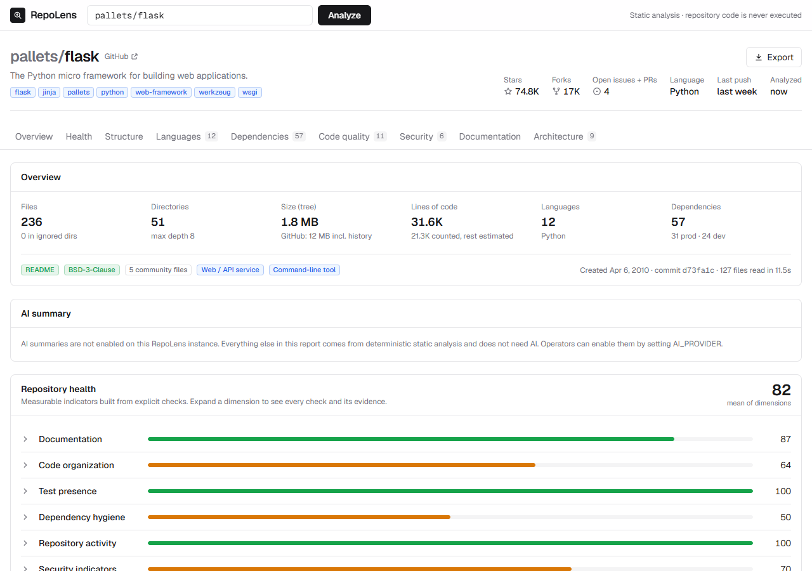
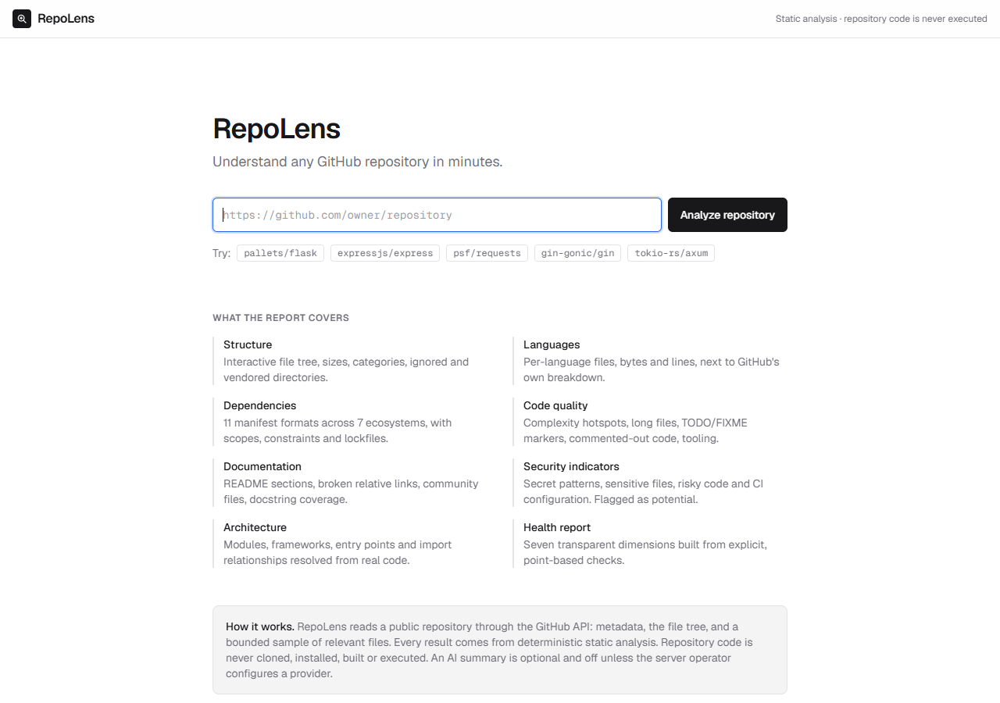
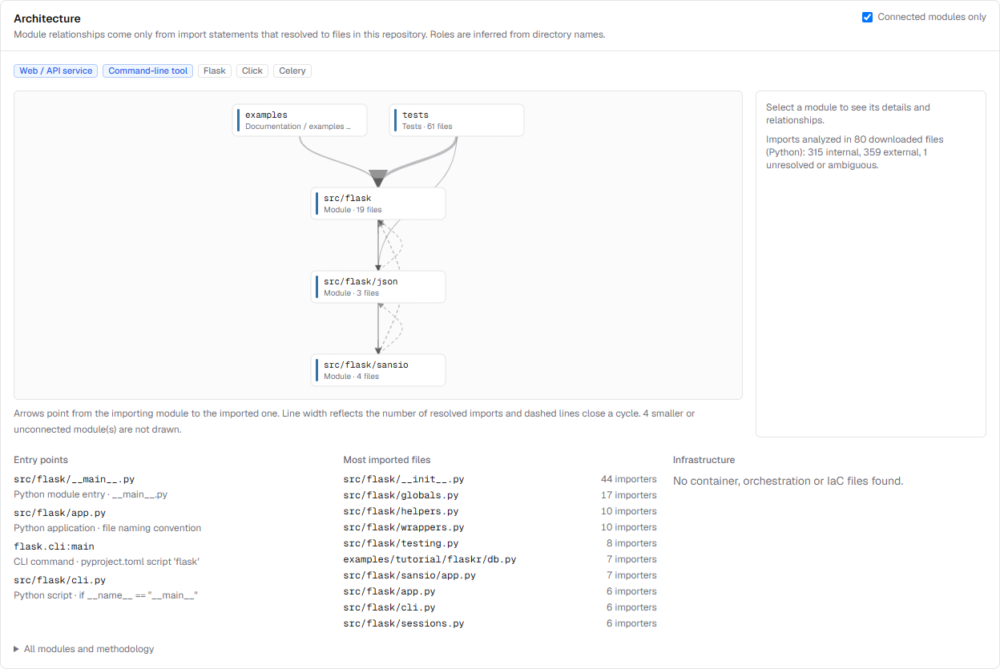
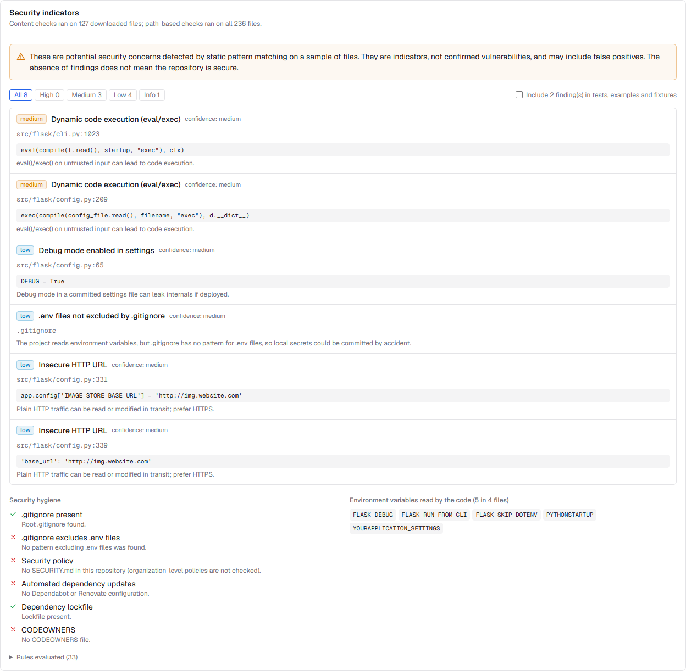

# RepoLens

> Understand any GitHub repository in minutes.

RepoLens analyzes a public GitHub repository and produces an engineering report for someone
meeting the codebase for the first time: how it is structured, which languages and
dependencies it uses, where the complexity sits, how well it is documented, which potential
security concerns deserve a look, and how its modules depend on each other.

Everything in the report comes from **deterministic static analysis**. RepoLens never clones,
installs, builds or runs the code it analyzes. An AI summary is available as an optional
extra; the tool is fully functional without it and without any paid API.



## Contents

- [What it does](#what-it-does)
- [Features](#features)
- [Architecture](#architecture)
- [Screenshots](#screenshots)
- [Tech stack](#tech-stack)
- [Local setup](#local-setup)
- [Environment variables](#environment-variables)
- [GitHub API configuration](#github-api-configuration)
- [Running the backend](#running-the-backend)
- [Running the frontend](#running-the-frontend)
- [Testing](#testing)
- [Deployment](#deployment)
- [Limitations](#limitations)
- [Security considerations](#security-considerations)
- [Roadmap](#roadmap)
- [Contributing](#contributing)
- [License](#license)

## What it does

Paste a URL such as `https://github.com/pallets/flask`. RepoLens then:

1. validates the URL and resolves the repository;
2. reads its metadata and the complete file tree, pinned to the default branch's head commit;
3. downloads a bounded, prioritized sample of relevant files (manifests, docs, configuration,
   then source spread across directories);
4. runs its analyzers on that snapshot;
5. shows the results in a dashboard, streaming progress while it works.

A typical analysis uses **4 GitHub REST API calls**, because file contents come from GitHub's
raw content host. Most repositories finish in 5 to 40 seconds. Every report links back to
files and lines at the exact analyzed commit.

## Features

| Area | What you get |
| --- | --- |
| **Overview** | Stars, forks, open issues, primary language, last push, size, file and directory counts, lines of code, dependency count, project type. |
| **Health report** | Seven dimensions (documentation, code organization, test presence, dependency hygiene, activity, security indicators, project structure), each a list of explicit checks with points and evidence. The overall number is the unweighted mean of those dimensions. No AI is involved in scoring. |
| **Structure** | An interactive, filterable file tree; file categories; largest files and directories. Generated and vendored directories (`node_modules/`, `dist/`, `venv/`, ...) are counted but not analyzed. |
| **Languages** | Files, bytes and lines per language (exact for downloaded files, clearly marked estimates for the rest) and comment ratios, next to GitHub's linguist breakdown. |
| **Dependencies** | 11 manifest formats across npm, PyPI, Maven/Gradle, crates.io, Go, Packagist and RubyGems: name, version constraint, scope (production/dev/optional/peer/build), source, lockfile coverage, and packages declared with conflicting versions. |
| **Code quality** | McCabe complexity for Python functions (from the AST), a labelled heuristic for other languages, long files, TODO/FIXME/HACK/XXX markers linked to their lines, possible commented-out code, and detected CI, linters, formatters, type checkers and test frameworks. |
| **Documentation** | README metrics, standard sections, broken relative links, license, contributing guide, changelog, code of conduct, security policy, issue/PR templates, docs site generator, docstring coverage. |
| **Security indicators** | Known token formats (redacted), credential-like assignments, committed `.env` files, keys and Terraform state, risky calls (`eval`, `pickle`, `shell=True`, disabled TLS verification...), insecure HTTP URLs, GitHub Actions risks, unpinned container images, secret-looking env vars exposed to the browser, and `.gitignore` hygiene. |
| **Architecture** | Modules, their inferred roles, frameworks (each with its evidence), entry points, infrastructure (Docker, Compose, Kubernetes, Terraform...), and an interactive graph of module dependencies built from import statements that resolve to real files. |
| **AI summary** *(optional)* | Purpose, architecture, key modules, entry points, maintenance concerns and onboarding steps, generated from the deterministic report and clearly labelled as AI output. |
| **Export** | Markdown, standalone HTML, full JSON, and print/PDF. |

## Architecture

```
Browser ──> Next.js (frontend/)                        FastAPI (backend/)
            ├─ pages: /, /analyze/{owner}/{repo}
            └─ /api/analyze ─ NDJSON stream proxy ──>  POST /api/analyze/stream
               /api/ai-summary ─────────────────────>  POST /api/ai/summary
                                                          │
                                  services/  github_client ─> api.github.com (4 calls)
                                             content_fetcher ─> raw.githubusercontent.com
                                             snapshot (metadata + tree + bounded contents)
                                                          │
                                  analyzers/ (pure functions of the snapshot, no I/O)
                                             file_classifier · structure · language_analyzer
                                             dependency_parsers/_analyzer · code_analyzer
                                             documentation_analyzer · security_analyzer
                                             import_graph · architecture_analyzer
                                             report_generator (health)
                                                          │
                                  schemas/   Pydantic report ─> OpenAPI ─> generated TS types
```

- **Stateless.** No database. Reports live in a small in-memory TTL cache. Identical analyses
  that run concurrently are merged into one.
- **Analyzers are pure functions** of a snapshot. All network I/O happens in `services/`,
  which keeps the analyzers fast and easy to test.
- **Typed end to end.** The backend's OpenAPI schema generates the frontend's TypeScript
  types, and CI fails if either one drifts.

## Screenshots

| Landing page | Architecture |
| --- | --- |
|  |  |



*Screenshots show a real analysis of [pallets/flask](https://github.com/pallets/flask).*

## Tech stack

- **Frontend:** Next.js 16 (App Router), React 19, TypeScript, Tailwind CSS 4. Charts and the
  architecture graph are hand-written SVG, so there are no chart-library dependencies.
- **Backend:** Python 3.11+, FastAPI, Pydantic v2, httpx (async), defusedxml.
- **Analysis:** the GitHub REST API, Python's `ast` module, TOML/JSON/XML parsers from the
  standard library (plus defusedxml), and carefully bounded regular expressions.
- **Optional AI:** the Anthropic SDK (`[ai]` extra) or any OpenAI-compatible HTTP endpoint.
- **Quality:** pytest, ruff, Vitest, Testing Library, ESLint, GitHub Actions.

## Local setup

Requirements: **Python 3.11+** and **Node.js 20+** (22 recommended).

```bash
git clone https://github.com/<you>/repolens.git
cd repolens
cp .env.example backend/.env                 # optional: add GITHUB_TOKEN
cp .env.example frontend/.env.local          # optional: the frontend reads REPOLENS_* only
```

Then start the backend and the frontend (below) and open http://localhost:3000.
Alternatively, run everything with Docker: `docker compose up --build`.

## Environment variables

All configuration is environment-based. [`.env.example`](.env.example) documents every option.
The most important ones:

| Variable | Where | Default | Purpose |
| --- | --- | --- | --- |
| `GITHUB_TOKEN` | backend | *(empty)* | Optional. Raises the GitHub API limit from 60 to 5,000 requests/hour. |
| `CORS_ORIGINS` | backend | `http://localhost:3000` | Origins allowed to call the API directly. |
| `RATE_LIMIT_PER_MINUTE` | backend | `10` | Analyses per client per minute (`0` disables). |
| `MAX_FILES_TO_FETCH`, `MAX_FILE_BYTES`, `MAX_TOTAL_FETCH_BYTES`, `MAX_TREE_ENTRIES` | backend | 300 / 400 KB / 20 MB / 50,000 | Bounds on how much of a repository is read. |
| `ANALYSIS_TIMEOUT_SECONDS`, `MAX_CONCURRENT_ANALYSES` | backend | 110 / 4 | Time and concurrency limits. |
| `PROXY_SHARED_SECRET` / `REPOLENS_PROXY_SECRET` | backend / frontend | *(empty)* | Lets the backend trust the client IP reported by the frontend, for per-user rate limits in public deployments. |
| `AI_PROVIDER`, `AI_API_KEY`, `AI_MODEL`, `AI_BASE_URL` | backend | *(empty: AI off)* | Optional AI summaries. |
| `REPOLENS_API_URL` | frontend | `http://localhost:8000` | Backend URL. Used server-side only; never exposed to the browser. |

## GitHub API configuration

RepoLens works without credentials, but unauthenticated clients are limited to **60 GitHub API
requests per hour per IP**, roughly 15 analyses. For anything beyond personal use:

1. Create a [fine-grained personal access token](https://github.com/settings/personal-access-tokens/new).
2. Select **Public repositories (read-only)**. No other permissions are needed.
3. Set it as `GITHUB_TOKEN` for the backend. This allows 5,000 requests per hour.

The token is only ever sent to `api.github.com`. It is never sent to the frontend, never
logged, and never included in reports. When GitHub's limit is reached, the UI shows when it
resets.

## Running the backend

```bash
cd backend
python -m venv .venv
source .venv/bin/activate          # Windows: .venv\Scripts\activate
pip install -e ".[dev]"            # add ",ai" to enable the Anthropic provider
uvicorn app.main:app --reload --port 8000
```

- Interactive API docs: http://localhost:8000/docs
- Health check: `GET /api/health`
- Full report: `POST /api/analyze` with `{"repository_url": "https://github.com/owner/repo"}`
- Streaming progress: `POST /api/analyze/stream` returns NDJSON events (`progress`, then
  `result` or `error`)
- Optional AI summary: `POST /api/ai/summary` (returns `503 ai_unavailable` when AI is off)

Errors always have the same shape: `{"error": {"code", "message", "details"}}`. Codes include
`invalid_repository_url`, `repository_not_found`, `rate_limited` (GitHub),
`too_many_requests` (this instance), `analysis_timeout`, `server_busy` and `upstream_error`.

## Running the frontend

```bash
cd frontend
npm install
npm run dev                       # http://localhost:3000
```

Set `REPOLENS_API_URL` if the backend is not on `http://localhost:8000`. A production
build is `npm run build && npm start`.

## Testing

```bash
# Backend: unit, integration (full pipeline through the HTTP API) and hardening tests
cd backend && pytest && ruff check . && ruff format --check .

# Frontend: unit and component tests, lint, types, production build
cd frontend && npm test && npm run lint && npm run typecheck && npm run build
```

Backend tests run against an in-process fake of GitHub that serves real HTTP responses, so
the production client, fetcher and analyzers run unmodified and no network access is needed.
The frontend's dashboard tests render a report produced by that same pipeline
(`python -m tests.generate_frontend_fixture`). CI runs all of the above on every push.

## Deployment

The recommended free setup is the **frontend on Vercel** and the **backend on Render**
(blueprint included). Fly.io, Railway, Koyeb or a single VM with Docker Compose also work.
[docs/deployment.md](docs/deployment.md) has step-by-step instructions, including the
proxy secret, AI providers and operating notes.

## Limitations

- **Public repositories only.** Private and deleted repositories both appear as "not found".
- **Sampling.** Content-based metrics (complexity, markers, security patterns, imports, exact
  line counts) cover the downloaded files: up to 300 per analysis, chosen by priority and
  spread across directories. The report states its coverage, and file-tree metrics always
  cover the whole repository.
- **Very large repositories.** GitHub truncates trees beyond about 100,000 entries, and
  RepoLens caps what it reads. Reports mark truncated and partial analyses.
- **Heuristics.** Complexity outside Python, commented-out code detection, module roles and
  security patterns are heuristics and are labelled as such. Security indicators can include
  false positives and miss real issues.
- **No vulnerability data.** RepoLens does not check dependencies against a vulnerability
  database. Use OSV-Scanner, `npm audit` or `pip-audit` for that.
- **Import resolution** covers Python, JavaScript/TypeScript, Go, Rust and Java/Kotlin.
  Other languages show modules without relationships.
- **Single instance.** Caches and rate limits are per process.

## Security considerations

- **Repository code is never executed.** Manifests are parsed as data (TOML, JSON and XML
  parsers, the latter hardened against entity expansion and XXE; regular expressions for
  Gradle and Gemfile), and Python source is only parsed with `ast`.
- **Untrusted input everywhere.** File paths from GitHub are validated (no traversal,
  absolute paths or control characters), downloads are size-capped while streaming, binary
  files are skipped, and every regular expression is bounded.
- **Outbound allowlist.** The backend only contacts `api.github.com`,
  `raw.githubusercontent.com` and the configured AI endpoint, including across redirects.
- **Secrets stay secret.** Matched secrets are redacted in reports. `GITHUB_TOKEN` and AI keys
  stay on the server.
- **Prompt injection.** The optional AI receives a length-capped digest of the analysis, never
  raw files. All repository-derived text is fenced as untrusted data, the model output is
  schema-validated, and it is displayed as plain text.
- **Abuse protection.** Per-client rate limits, bounded concurrency, time limits, request size
  limits, security headers and a strict Content-Security-Policy. Exported HTML files forbid
  scripts.
- **Careful wording.** Findings are potential concerns. RepoLens never states that a
  repository is secure.

Please report vulnerabilities in RepoLens privately. See [SECURITY.md](SECURITY.md).

## Roadmap

- Vulnerability data from [OSV.dev](https://osv.dev) for pinned dependency versions.
- Lockfile parsing for resolved versions and transitive dependency counts.
- Tree-sitter parsing for precise complexity and imports in more languages.
- Historical signals (commit cadence, contributor distribution, release frequency).
- Comparing two repositories or two commits of the same repository.
- Optional authenticated analysis of private repositories through a GitHub App.

## Contributing

Contributions are welcome. [CONTRIBUTING.md](CONTRIBUTING.md) covers the ground rules (never
execute repository code, deterministic first, no fabricated data), development setup, and
how to add an analyzer. Bugs and incorrect analysis results can be reported through the
issue forms.

## License

[MIT](LICENSE) © RepoLens contributors
